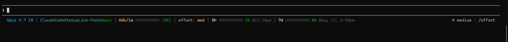

# Claude Code Status Line

Status line tuỳ biến cho [Claude Code](https://claude.com/claude-code): hiển thị model, token usage, rate limit, thời gian reset trên một dòng duy nhất. Chạy như một external shell command nên không làm chậm Claude Code và không tốn thêm token nào.

## Screenshot



## Điểm khác biệt của fork này

So với upstream `v1.4.2`, fork này thêm/sửa:

| Thay đổi | Mô tả |
|---|---|
| **Thanh progress 10 ô** | Khôi phục `■■■■■■■■■□` cho cả tokens / 5h / 7d (upstream đã bỏ từ v1.4.x). Màu thay đổi theo % usage. |
| **Thứ trong tuần kiểu Việt** | `@may 12, 6:00pm` → `@18:00, T2 12/5`. Map `T2..T7, CN` thay vì `Mon..Sun`. |
| **Giờ 24h** | `@6:00pm` → `@18:00`. Format `HH:mm` thay vì `h:mmtt`. |
| **Ngày kiểu Việt** | `MMM d` (`may 12`) → `d/M` (`12/5`). |
| **Sửa encoding UTF-8** | Set `[Console]::OutputEncoding = UTF8` để Windows PowerShell 5.1 in đúng `■` `□`, không bị `�-�`. |
| **File UTF-8 with BOM** | Đảm bảo PS 5.1 đọc đúng ký tự non-ASCII trong source. |

## Các thành phần trên status line

| Phần | Ý nghĩa |
|---|---|
| **Model** | Tên model hiện tại (vd: `Opus 4.7 1M`) |
| **CWD@Branch** | Thư mục làm việc, git branch, số dòng thay đổi (+/-) |
| **Tokens** | Số token đã dùng / tổng context window + thanh bar + % |
| **Effort** | Reasoning effort: `low`, `med`, `high`, `xhigh`, `max` |
| **5h** | % rate limit 5 giờ + thanh bar + thời gian reset (24h) |
| **7d** | % rate limit 7 ngày + thanh bar + thời gian reset (`HH:mm, T# d/M`) |
| **Extra** | Số credit extra đã dùng / hạn mức (nếu bật) |
| **Update** | Hiển thị khi có version mới (check mỗi 24h) |

Màu theo % usage: xanh lá (<50%) → vàng (≥50%) → cam (≥70%) → đỏ (≥90%).

## Cài đặt (Windows / PowerShell)

1. Clone fork về `~/.claude/statusline/`:
   ```powershell
   git clone https://github.com/dungartoriaaa/ClaudeCodeStatusLine.git "$env:USERPROFILE\.claude\statusline"
   ```
2. **Lấy đường dẫn tuyệt đối** tới `statusline.ps1` (bắt buộc — xem cảnh báo bên dưới):
   ```powershell
   echo "$env:USERPROFILE\.claude\statusline\statusline.ps1"
   ```
   Kết quả ví dụ: `C:\Users\TenCuaBan\.claude\statusline\statusline.ps1`.
3. Mở `~/.claude/settings.json`, dán **đường dẫn tuyệt đối** đó vào (thay `C:\\Users\\TenCuaBan` bằng kết quả ở bước 2, lưu ý dùng `\\` để escape trong JSON):
   ```json
   {
     "statusLine": {
       "type": "command",
       "command": "powershell -NoProfile -ExecutionPolicy Bypass -File \"C:\\Users\\TenCuaBan\\.claude\\statusline\\statusline.ps1\""
     }
   }
   ```
4. Restart Claude Code.

> ⚠ **KHÔNG dùng `%USERPROFILE%` hay `~` trong `settings.json`.** Claude Code (bản hiện tại trên Windows) **không expand** các biến môi trường / `~` trong field `command` khi nó chứa flag PowerShell — `powershell.exe` nhận chuỗi `%USERPROFILE%` như literal text → tìm thư mục tên đúng vậy → không thấy file → status line im lặng tắt, không có error. Đây là lý do "đường dẫn ảo" hay gặp.
>
> Nếu bắt buộc phải dùng biến (ví dụ chia sẻ config giữa nhiều máy có tên user khác nhau), bọc trong `cmd /c` để CMD expand trước rồi mới gọi PowerShell — xem [INSTALL.md](INSTALL.md) phần *Đường dẫn tuyệt đối vs biến môi trường*.

Chi tiết đầy đủ (kèm hướng dẫn macOS/Linux) xem [INSTALL.md](INSTALL.md).

## Cập nhật

```powershell
git -C "$env:USERPROFILE\.claude\statusline" pull
```

Không cần sửa lại `settings.json` — đường dẫn vẫn nguyên qua các version.

## Yêu cầu

- Claude Code đã đăng nhập OAuth (Pro/Max để có dữ liệu rate-limit và extra-usage)
- `git` trong `PATH`
- **Windows:** PowerShell 5.1+ (mặc định Windows 10/11)
- **macOS / Linux:** `jq` và `curl`

## Cache

Dữ liệu usage từ Anthropic API được cache 60 giây tại `%TEMP%\claude\statusline-usage-cache-<hash>.json` (hoặc `/tmp/claude/...` trên *nix). Release check cache 24 giờ. Cache share giữa các Claude Code instance để tránh rate limit.

## Thông báo cập nhật

Status line check GitHub mỗi 24 giờ. Khi có version mới, một dòng phụ sẽ xuất hiện bên dưới. Nếu API không truy cập được, check sẽ thất bại im lặng.

## License

MIT

## Credits

- Upstream tác giả: **Daniel Oliveira** — [Website](https://danielapoliveira.com/) · [X](https://x.com/daniel_not_nerd) · [LinkedIn](https://www.linkedin.com/in/daniel-ap-oliveira/)
- Fork maintainer: **[@dungartoriaaa](https://github.com/dungartoriaaa)**
